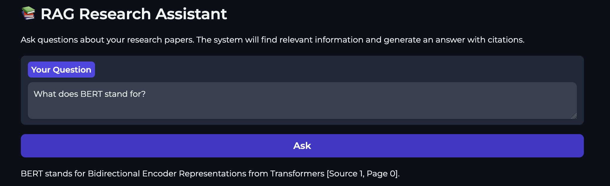

# RAG Research Assistant

A production-ready RAG system for querying academic papers with **22% MRR improvement** through fine-tuned embeddings, hybrid retrieval, and neural reranking.


## Demo



## Highlights

- **22% MRR improvement** over base model (0.75 to 0.91)
- **87% Hits@1** - correct answer ranked first 87% of the time
- **Hybrid retrieval** combining semantic search + BM25 keyword matching
- **CrossEncoder reranking** for precision on retrieved candidates
- **Rigorous evaluation** with 5-fold CV and 100 negative samples per query

## Architecture

```
Query
  |
  v
+-------------------------------+
|  Hybrid Search                |
|  (Semantic 60% + BM25 40%)    |
+-------------------------------+
  |
  v
+-------------------------------+
|  CrossEncoder Reranker        |
|  (ms-marco-MiniLM-L-6-v2)     |
+-------------------------------+
  |
  v
+-------------------------------+
|  LLM Generation               |
|  (Gemini 2.5 Flash)           |
+-------------------------------+
  |
  v
Answer + Source Citations
```

## Quick Start

```bash
# Clone the repository
git clone https://github.com/rid-saw/RAG-research-assistant.git
cd RAG-research-assistant

# Create virtual environment
python -m venv venv
source venv/bin/activate  # On Windows: venv\Scripts\activate

# Install dependencies
pip install -r requirements.txt

# Set up API key
echo "GOOGLE_API_KEY=your_gemini_api_key" > .env

# Run the application
python src/app.py
```

Open http://localhost:7860 in your browser.

## ⚖️ Copyright & Architecture

To respect intellectual property and keep the repository lightweight, this project uses a **runtime-fetch** architecture.

**Included in this repo:**
- ✅ `chroma_db/` - Pre-computed vector embeddings (33MB).
- ✅ `models/` - Fine-tuned embedding models (88MB).
- ✅ `arxiv_papers.json` - A manifest of 25 arXiv IDs used for the knowledge base.

**NOT included:**
- ❌ Original PDF files (~250MB) - These are fetched from arXiv's official servers during setup.

### How it works:
1. **Bootstrap:** On the first run, the system verifies the `chroma_db`.
2. **Fetch:** If data is missing, the app uses the IDs in `arxiv_papers.json` to download PDFs directly from arXiv via their API.
3. **Process:** PDFs are parsed, chunked, and stored as embeddings.
4. **Cleanup:** Temporary PDFs are deleted after ingestion to save disk space.

### Manual Setup
If you prefer to pre-download the source material:
```bash
python src/download_arxiv.py          # Download all papers
python src/download_arxiv.py --clean  # Remove PDFs after embedding
```

## Results

Fine-tuned embeddings evaluated with rigorous methodology (5-fold CV, 100 negative samples):

| Metric | Base Model | Fine-tuned | Improvement |
|--------|------------|------------|-------------|
| **MRR** | 0.7493 | **0.9149** | **+22.1%** |
| **Hits@1** | 0.6545 | **0.8691** | **+32.8%** |
| Hits@5 | 0.8618 | 0.9709 | +12.7% |
| Hits@10 | 0.9018 | 0.9855 | +9.3% |
| NDCG@10 | 0.7836 | 0.9317 | +18.9% |

## Project Structure

```
RAG-research-assistant/
├── src/
│   ├── app.py                    # Gradio web interface
│   ├── retriever.py              # Hybrid retriever + reranking
│   ├── ingest.py                 # PDF loading and chunking
│   ├── fine_tune_embeddings.py   # Embedding fine-tuning
│   └── generate_training_data.py # LLM-powered Q&A generation
├── evaluation/
│   ├── evaluate.py               # Rigorous evaluation script
│   └── training_pairs.json       # 275 Q&A training pairs
├── models/
│   └── fine-tuned-embeddings/    # Fine-tuned model weights
├── data/                         # Research papers (PDFs)
└── chroma_db/                    # Vector database
```

## Key Features

### Hybrid Retrieval
Combines semantic search (fine-tuned embeddings) with BM25 keyword matching for robust retrieval that handles both meaning and exact terms.

### CrossEncoder Reranking
After initial retrieval, a CrossEncoder model re-scores candidates by seeing query and passage together - significantly more accurate than bi-encoder similarity alone.

### Fine-tuned Embeddings
Domain-adapted `all-MiniLM-L6-v2` trained on 275 LLM-generated Q&A pairs using `MultipleNegativesRankingLoss`.

### Rigorous Evaluation
- 5-fold cross-validation for stable metrics
- 100 negative distractors per query (realistic retrieval simulation)
- Multiple metrics: MRR, Hits@k, NDCG@10

## Usage

### Running the Web Interface
```bash
python src/app.py
# Opens at http://localhost:7860
```

### Fine-tuning Embeddings
```bash
# Generate training data (requires Gemini API)
python src/generate_training_data.py

# Fine-tune the model
python src/fine_tune_embeddings.py
```

### Running Evaluation
```bash
python evaluation/evaluate.py
# Compares base vs fine-tuned model
# Results saved to evaluation/evaluation_results.json
```

### Adding New Papers
```bash
# 1. Add PDFs to data/
cp new_paper.pdf data/

# 2. Clear vector store and restart
rm -rf chroma_db/
python src/app.py
```

## Tech Stack

- **Embeddings:** Sentence Transformers (fine-tuned all-MiniLM-L6-v2)
- **Reranking:** CrossEncoder (ms-marco-MiniLM-L-6-v2)
- **Vector Store:** ChromaDB
- **Keyword Search:** BM25 (rank-bm25)
- **LLM:** Google Gemini 2.5 Flash
- **Framework:** LangChain
- **Interface:** Gradio

## Data Setup

To use this project:

1. **Add your own papers** to the `data/` folder (PDF format)
2. **Generate training data:**
   ```bash
   python src/generate_training_data.py
   ```
3. **Fine-tune the embeddings:**
   ```bash
   python src/fine_tune_embeddings.py
   ```

The project was developed using research papers covering Foundation Models, 3D Vision, Generative AI, and RAG techniques.

## License

MIT License - feel free to use this project for learning and building.

## Acknowledgments

- [Sentence Transformers](https://www.sbert.net/) for embedding models
- [LangChain](https://langchain.com/) for RAG orchestration
- [Gradio](https://gradio.app/) for the web interface
