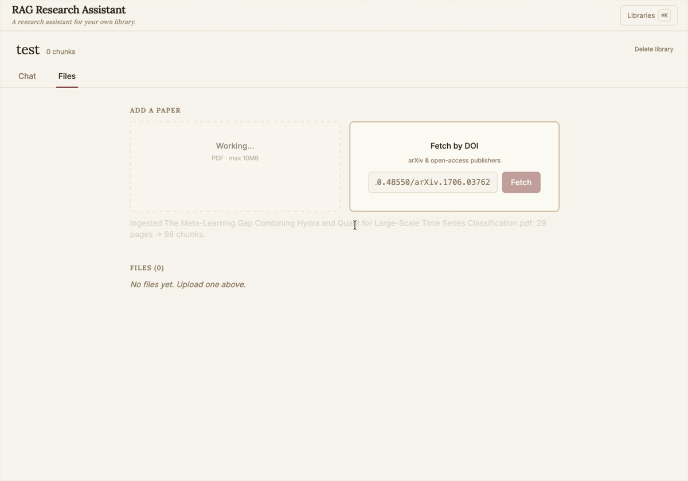

# RAG Research Assistant

> A research assistant for your own library. Cited answers, not confident guesses.

Upload research papers (or paste a DOI), then chat with them. Every answer is grounded in the passages it came from, with page-level citations. When the library doesn't have an answer, the assistant says so — and only searches the web with your explicit consent.

This project is deliberately a single coherent system rather than a notebook of tricks: a FastAPI backend, a Vite + React + Tailwind frontend, and an MCP server that exposes the same pipeline to Claude Desktop.




## What's interesting about it

- **Corrective RAG (Yan, 2024):** retrieve → grade → answer-or-refuse → opt-in web fallback. A small LLM grader inspects the retrieved passages and explicitly decides whether they support a grounded answer. If not, the user is asked before any web search runs.
- **Hardened refusal:** even when the grader passes, the answer LLM is instructed to emit a single `INSUFFICIENT_CONTEXT` token rather than hallucinate. The orchestrator catches this as a second safety net and converts it into a calm refusal message — no fake sources, no padding.
- **Hybrid retrieval + neural reranking:** BGE bi-encoder embeddings (60%) fused with BM25 keyword scores (40%) for broad recall, then a CrossEncoder reranks the top candidates for precision.
- **Streaming pipeline UI:** the frontend renders Server-Sent Events from the orchestrator — first the active stage (`Retrieving → Grading → Generating`), then the answer tokens as they arrive, then citations. The agentic flow is *visible*, not hidden behind a spinner.
- **Inline citations:** the LLM emits `[1] [2] [3]` markers that the frontend converts into superscript footnotes with hover-card popovers showing the source snippet.
- **DOI ingestion:** paste an arXiv or open-access DOI, and the backend resolves it via Unpaywall (or a direct arXiv fast path) and ingests the PDF. Paywalled papers fail loudly with the paper's title so the user knows what was attempted.
- **MCP server:** the same pipeline is exposed over the Model Context Protocol so Claude Desktop (or any MCP client) can `list_libraries`, `create_library`, `search_library`, `ask_library`.
- **Editorial UI:** cream + warm browns + a single oxblood accent. Lora serif for headings, ⌘K palette for library switching, framer-motion for stage transitions and citation popovers.

## Architecture

```
PDF or DOI
   │
   ▼
┌─────────────┐    BGE embeddings    ┌──────────────┐
│   Ingest    │ ───────────────────▶ │  ChromaDB    │
│   chunker   │                      │  (per-lib)   │
└─────────────┘    BM25 tokenize ──▶ │  + BM25 idx  │
                                     └──────┬───────┘
                                            │
   Query ──▶ Hybrid retrieve (0.6 sem + 0.4 BM25)
                                            │
                                  CrossEncoder rerank
                                            │
                                            ▼
                                   ┌────────────────┐
                                   │   LLM grader   │  ←─ "sufficient?"
                                   └────────┬───────┘
                                            │
                       sufficient ──────────┤──────── insufficient
                            │                              │
                            ▼                              ▼
                     ┌───────────┐                ┌──────────────────┐
                     │  Answer   │                │ Ask user consent │
                     │  with     │                └────────┬─────────┘
                     │ citations │                         │ (yes)
                     └───────────┘                         ▼
                                                   ┌─────────────┐
                                                   │  Rewrite Q  │
                                                   └──────┬──────┘
                                                          ▼
                                                   ┌──────────────┐
                                                   │ Tavily web   │
                                                   │ + answer LLM │
                                                   └──────────────┘
```

## Stack

**Backend (Python 3.13, uv):** FastAPI, ChromaDB, sentence-transformers (BGE bi-encoder + CrossEncoder), rank-bm25, langchain (utility imports only — `Document`, `RecursiveCharacterTextSplitter`, `PyPDFLoader`, Chroma wrapper), OpenAI-compatible client pointed at Mistral/OpenAI/Groq/OpenRouter/Gemini.

**Frontend (Node 25, Vite):** React + TypeScript, Tailwind, framer-motion, cmdk (command palette), jsPDF (client-side chat export).

**MCP server:** official `mcp` Python SDK over stdio.

**LLM:** Mistral by default (`mistral-small-latest` — free tier, no card). Easy swap to any OpenAI-compatible provider via one env var.

**Web search:** Tavily (1000 free searches/month).

## Run locally

```bash
# 1. Get a free Mistral key (no card): https://console.mistral.ai
#    (optional) Get a free Tavily key for web fallback: https://tavily.com

# 2. Copy env template, fill in keys
cp .env.example .env
$EDITOR .env

# 3. One command runs backend + frontend together with prefixed output
./dev.sh
```

Backend serves at `http://localhost:8000`. Frontend at `http://localhost:5173`.

Ctrl-C kills both cleanly. The script also frees `:8000` and `:5173` first if a previous run left them stuck.

### Run pieces individually

```bash
# Backend
cd backend && uv run uvicorn app.main:app --reload

# Frontend
cd frontend && npm install && npm run dev

# MCP server (separately, for Claude Desktop)
cd mcp_server && uv run python server.py
```

## Project structure

```
RAG-research-assistant/
├── backend/                       # FastAPI service
│   └── app/
│       ├── api/                   # HTTP handlers
│       │   ├── chat.py            # POST /chat, POST /chat/stream (SSE)
│       │   ├── libraries.py       # CRUD + upload + DOI ingest
│       │   └── search.py          # raw retrieval, no LLM
│       ├── services/              # business logic
│       │   ├── orchestrator.py    # corrective RAG state machine
│       │   ├── grader.py          # LLM-judges-retrieval
│       │   ├── query_rewriter.py  # query → web search form
│       │   ├── retriever.py       # hybrid search + rerank
│       │   ├── reranker.py        # BGE CrossEncoder
│       │   ├── ingest.py          # PDF chunking, library CRUD
│       │   ├── doi.py             # arXiv + Unpaywall resolver
│       │   ├── web_search.py      # Tavily client
│       │   └── llm.py             # provider-agnostic LLM client
│       ├── core/
│       │   ├── config.py          # pydantic-settings, reads root .env
│       │   ├── chroma.py          # shared, lock-protected chromadb client
│       │   └── embeddings.py      # BGE bi-encoder loader
│       └── schemas/               # pydantic request/response models
│
├── frontend/                      # Vite + React + Tailwind UI
│   └── src/
│       ├── App.tsx                # single-file app: header, ⌘K palette,
│       │                          # streaming chat, files tab, etc.
│       └── index.css              # global styles + cream/brown tokens
│
├── mcp_server/                    # MCP wrapper over the backend
│   └── server.py                  # four tools, stdio transport
│
├── dev.sh                         # run backend + frontend together
├── .env.example                   # template — copy to .env
└── README.md
```

## MCP integration (optional)

To plug this into Claude Desktop, add to `~/Library/Application Support/Claude/claude_desktop_config.json`:

```json
{
  "mcpServers": {
    "rag-research-assistant": {
      "command": "uv",
      "args": [
        "--directory",
        "/absolute/path/to/RAG-research-assistant/mcp_server",
        "run",
        "python",
        "server.py"
      ],
      "env": { "BACKEND_URL": "http://localhost:8000" }
    }
  }
}
```

Restart Claude Desktop. You'll see four tools: `list_libraries`, `create_library`, `search_library`, `ask_library`. The `ask_library` tool's description instructs Claude to ask for user consent before setting `allow_web_search=true`, matching the corrective-RAG contract.

## Configuration

All config is via env vars (see `.env.example`). The main ones:

| Variable | Default | Notes |
|---|---|---|
| `LLM_PROVIDER` | `mistral` | Any OpenAI-compatible API |
| `LLM_MODEL` | `mistral-small-latest` | Provider-specific model id |
| `MISTRAL_API_KEY` | — | Required if provider is `mistral` |
| `TAVILY_API_KEY` | — | Optional; enables web fallback |
| `UNPAYWALL_EMAIL` | placeholder | Real email recommended for DOI lookups |

## Deploy

The repo ships a single multi-stage `Dockerfile` that builds the React frontend and serves it from the same FastAPI process. The default target is Hugging Face Spaces, but the image runs anywhere a container does.

**Hugging Face Spaces:**

```bash
# Add the Space as a second git remote alongside origin (GitHub)
git remote add hf https://huggingface.co/spaces/<your-username>/<space-name>
git push hf main
```

In Space Settings → set SDK to **Docker** and add three secrets: `MISTRAL_API_KEY`, `TAVILY_API_KEY` (optional, for web fallback), `UNPAYWALL_EMAIL`. The build runs automatically on push.

Notes for the demo deploy:
- Without a persistent disk add-on, uploaded libraries evaporate when the Space sleeps (48h idle). Fine for a demo; not a production guarantee.
- Cold start after sleep is ~30–60s while the embedding + reranker models load into memory.
- Local development is unaffected by any of this — `./dev.sh` still runs backend + Vite separately, and the Dockerfile is only touched by the container host.

## Roadmap

- [ ] Demo GIF in the README
- [ ] Persistent chat history (currently per-session)

## Acknowledgements

- Corrective-RAG idea adapted from Yan et al., 2024.
- BGE embeddings and CrossEncoder from BAAI.
- Unpaywall API by Our Research (non-profit) for open-access PDF discovery.
- arXiv API for the arXiv DOI fast path.

## License

[MIT](LICENSE)
